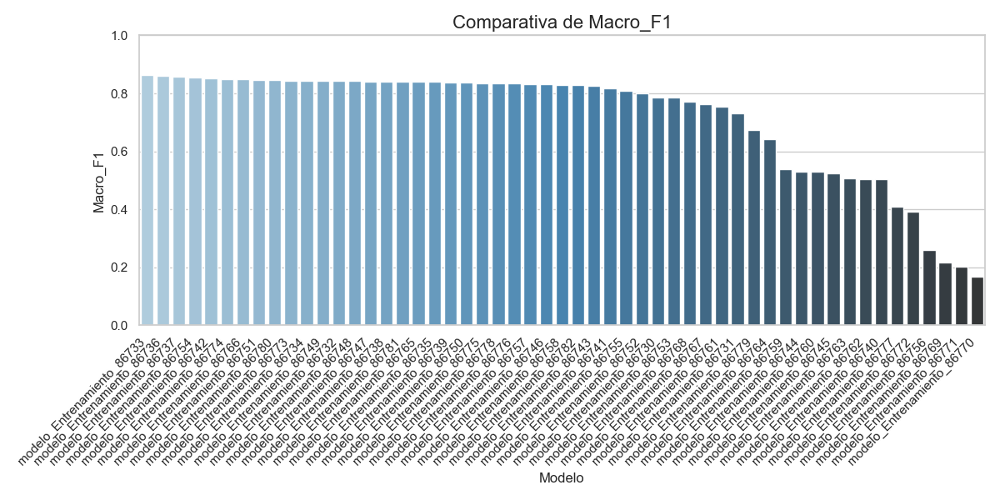
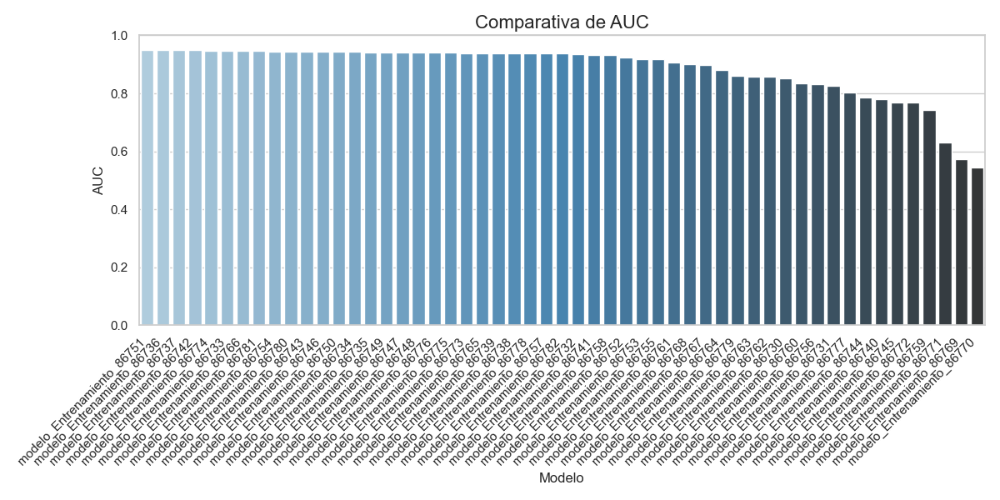
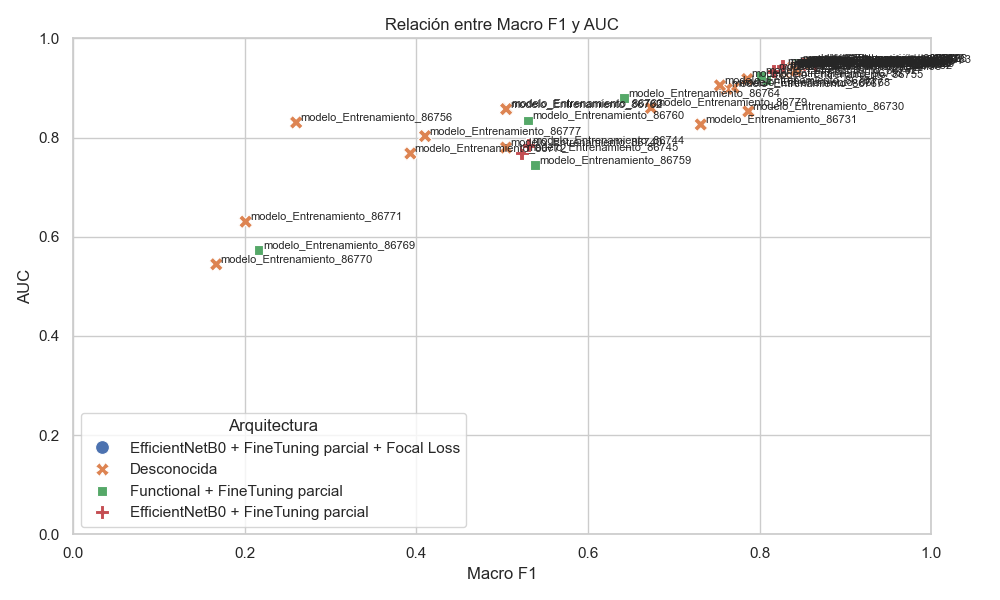

# Comparativa de Modelos IA - Gráficas

## Val Accuracy

## Macro F1

## AUC

## Macro Precision

## Macro Recall

## Radar por clase - modelo_Entrenamiento_86733

## Radar por clase - modelo_Entrenamiento_86736

## Radar por clase - modelo_Entrenamiento_86737

## Radar por clase - modelo_Entrenamiento_86754

## Radar por clase - modelo_Entrenamiento_86742

## Relación entre Macro F1 y AUC

